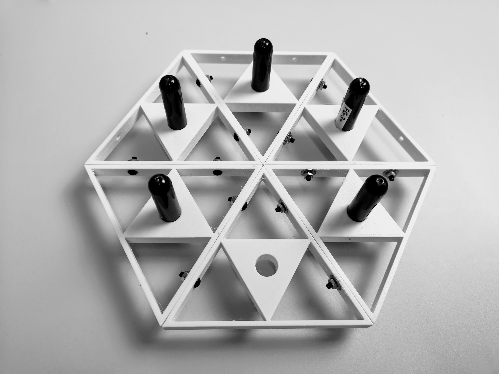
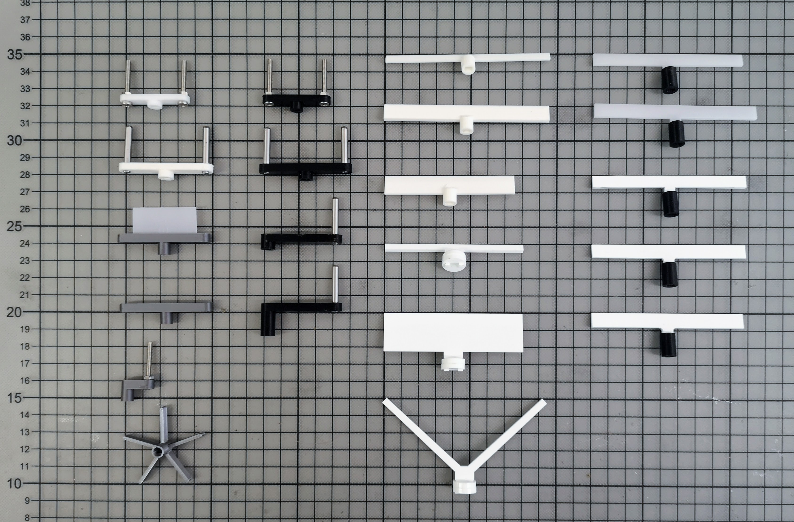

# Designing Parts for *Machines and Installations* with OpenSCAD

One day introduction into generative and parametric design for digital fabrication with the code-based 3D modelling software **openSCAD** - *The Programmers Solid 3D CAD Modeller* ( [openscad.org](https://openscad.org) ). The workshop offers a fundamental introduction into the concepts of openSCAD, basic ideas of parametric design, constructive solid geometry and suggests basic use cases for producing simple parts for machines and installations (e.g. pulley, motor holders, connectors, hubs, clips etc).

- **Date:** Saturday **2020-11-28** / **10:00** - **18:00**
- **Registration:** Send me an email or direct message for a **binding** registration. Please make sure that you are able to join the workshop for the **full day**. (The workshop is limited to **15 participants**)
- The workshop will be held **online via MS Teams.**

## Pre/Requirements:

1. Participants should have a **affinity** for code~ing!
2. Basic knowledge of programming languages like C or Java/Processing is **beneficial**.
3. Please install the latest **openSCAD** version from here: https://www.openscad.org/downloads.html (Please download the latest **developer snapshot** instead of the stable release)
5. A **three button** mouse incl. **wheel** is **very** helpful!
4. Coffee and food by hand.

## Schedule x Content *(preliminary)*:

* **10:00 - 12:00** | *Fundamentals*
  1. Introduction
  
     - Designing with code
     - Constructive solid geometry
     - Advantages and limits
     - Ecosystem
       + [Libraries](https://www.openscad.org/libraries.html) + standard parts
       + [thingyiverse.com](https://www.thingiverse.com/)

  2. Basic concepts of openSCAD 
  
     - Interface
     - Object primitives
     - Boolean operations
     - Debugging

  3. Q&A Time I
     - The participants can repeat and experiment the learned and ask questions  
     - Share your screen!

* **12:00 - 13:00** | *Lunch Break*

* **13:00 - 15:00** |  *Advanced concepts of openSCAD*

  4. Modules + Functions
  5. Loops + control structures
  6. Randomness + Sine 
  7.  Q&A Time II

* **15:00 - 16:00** | *Kaffee x Kuchen Break (Bring your own Cake)*

* **16:00 - 18:00** | *Parametric Design x Generative Design with openSCAD*

  8. Exporting
     - Designing for 3D printing (printability)
     - Exporting
     - Test print
  9. Outlook Parametric Design
  10. Outlook Generative Design

* **18:00** | *EOW*

## 3D Printed example

## Parametric example

## Links
* General

  - [OpenSCAD Cheat Sheet](https://www.openscad.org/cheatsheet/index.html)

* Articles

  - [OpenSCAD: 3D Modelling for coders](https://medium.com/@mr_koz/openscad-3d-modelling-for-coders-10dd40650dac)
  - [Faster 3D modelling with openscad](https://medium.com/@mr_koz/faster-3d-modelling-with-openscad-d6443f3eea79)
  - [Curated Code CAD](https://kurthutten.com/blog/curated-code-cad/)

* Tips and Tricks

  - [How does part orientation affect a 3D print?](https://www.3dhubs.com/knowledge-base/how-does-part-orientation-affect-3d-print/)
  - [How to use Heat-Set Inserts](https://hackaday.com/2019/02/28/threading-3d-printed-parts-how-to-use-heat-set-inserts/)
  - [Round-Anything, a pragmatic approach to OpenSCAD design](https://kurthutten.com/blog/round-anything-a-pragmatic-approach-to-openscad-design/)
  - [Round Anything Openscad - Making fillets easy](https://www.youtube.com/watch?v=laxv2wFKq8Q&feature=emb_title)
  - [Mastering OpenSCAD Workflow](https://hackaday.com/2018/11/14/mastering-openscad-workflow/)
  - [Designing 3D Printable Mechanisms in OpenSCAD](https://urish.medium.com/designing-3d-printable-mechanisms-in-openscad-5838dcb65b39)

* Libraries

  - [Overview](https://www.openscad.org/libraries.html)
  - [NopSCADlib](https://github.com/nophead/NopSCADlib)
  - [MCAD](https://github.com/openscad/MCAD)
  - [Round-Anything](https://github.com/Irev-Dev/Round-Anything)
  - [Thingiverse](https://www.thingiverse.com/)